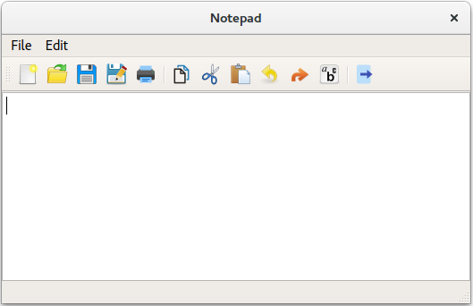
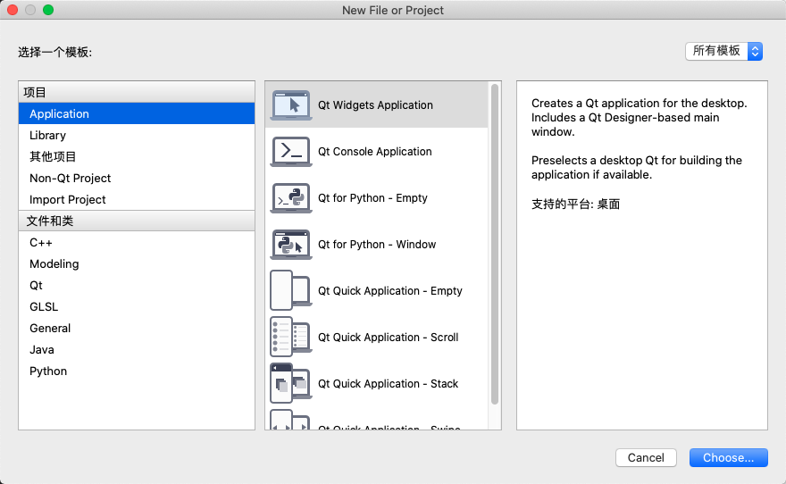
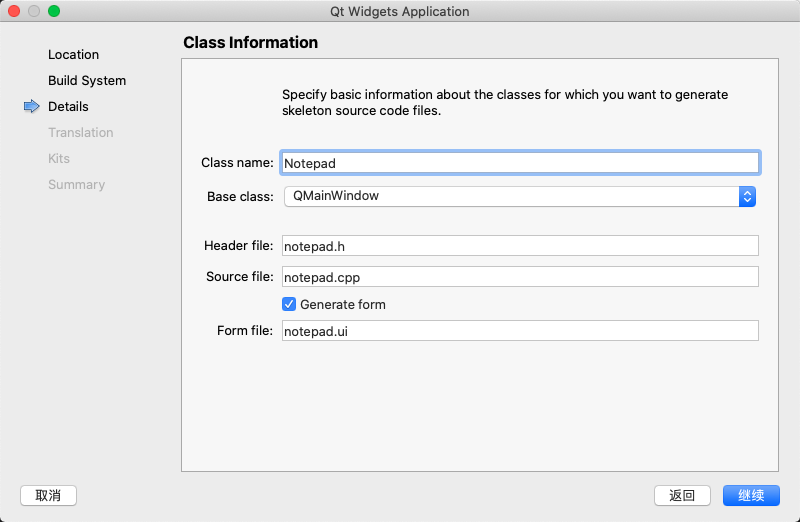
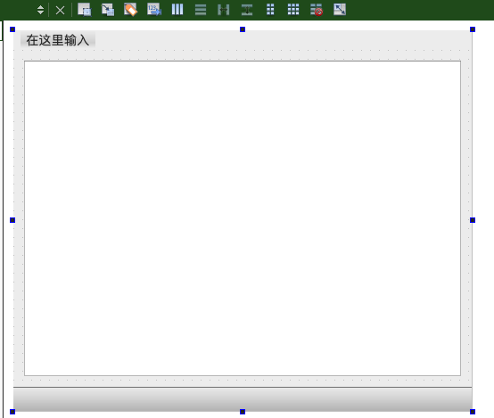

# 基于记事本应用程序的Qt小部件教程
在本主题中，我们通过使用C ++和Qt Widgets模块实现一个简单的记事本应用程序来教授基本的Qt知识。该应用程序是一个小型文本编辑器，可让您创建，保存，打印或重新打开并再次对其进行编辑的文本文件。您还可以设置要使用的字体。

## 1.创建记事本项目
在向导的帮助下，可以在Qt Creator中设置新项目，该向导将指导您逐步完成项目创建过程。向导会提示您输入该特定类型的项目所需的设置，并为您创建项目。



要创建记事本项目，请选择 “ 文件” >“ 新建文件”或“项目” >“ 应用程序” >“ Qt Widgets应用程序” > “选择”，然后按照向导的说明进行操作。在“ 类信息”对话框中，键入记事本作为类名称，然后选择QMainWindow作为基类。



“ Qt窗口小部件应用程序”向导创建一个项目，该项目包含一个主源文件和一组指定用户界面的文件（记事本窗口小部件）：
- notepad.pro-项目文件。
- main.cpp-应用程序的主要源文件。
- notepad.cpp-记事本小部件的记事本类的源文件。
- notepad.h-记事本小部件的记事本类的头文件。
- notepad.ui-记事本小部件的UI窗体。

.cpp，.h和.ui文件随附必要的样板代码，以便您能够构建和运行项目。.pro文件已完成。我们将在以下各节中仔细研究文件内容。
学到更多

## 2.主要源文件
该向导在main.cpp文件中生成以下代码：
```C++
#include "notepad.h"
#include <QApplication>

int main(int argc, char *argv[])
{
    QApplication a(argc, argv);
    Notepad w;
    w.show();
    return a.exec();
}
```
我们将逐行浏览代码。以下几行包括Notepad小部件和QApplication的头文件。所有Qt类都有一个以它们命名的头文件。
```C++
#include "notepad.h"
#include <QApplication>
```
以下行定义了主要功能，它是所有基于C和C ++的应用程序的入口点：
```C++
int main(int argc, char *argv[])
```
下一行创建一个QApplication对象。该对象管理应用程序范围的资源，对于运行任何使用Qt小部件的Qt程序是必需的。它使用argc在中运行的命令行参数构造一个应用程序对象argv。（对于不使用Qt小部件的GUI应用程序，可以改用QGuiApplication。）
```C++
QApplication a(argc, argv);
```
下一行创建记事本对象。这是向导为其创建类和UI文件的对象。用户界面包含widgets在Qt 中调用的可视元素。小部件的示例是文本编辑，滚动条，标签和单选按钮。小部件也可以是其他小部件的容器。例如对话框或主应用程序窗口。
```C++
Notepad w;
```
下一行在其自己的窗口中的屏幕上显示了记事本小部件。小部件还可以充当容器。QMainWindow就是一个例子，它通常包含几种类型的小部件。默认情况下，小部件不可见；函数show（）使小部件可见。
```C++
w.show();
```
下一行使QApplication进入其事件循环。Qt应用程序运行时，将生成事件并将其发送到该应用程序的小部件。事件的示例是鼠标按下和按键。
```C++
return a.exec();
```
## 3.设计UI
该向导将生成XML格式的用户界面定义：notepad.ui。在Qt Creator中打开notepad.ui文件时，它将在集成的Qt Designer中自动打开。
生成应用程序时，Qt Creator启动Qt 用户界面编译器（uic），该程序读取.ui文件并创建相应的C ++头文件ui_notepad.h。
### 3.1使用Qt Designer
该向导将创建一个使用QMainWindow的应用程序。它具有自己的布局，可以在其中添加菜单栏，停靠小部件，工具栏和状态栏。中心区域可以被任何类型的小部件占据。向导将“记事本”小部件放置在此处。
要在Qt Designer中添加小部件：
1. 在Qt Creator 编辑器模式下，双击“ 项目”视图中的notepad.ui文件，以在集成的Qt Designer中启动该文件。
2. 将小部件Text Edit（QTextEdit）拖放到窗体。
3. 按Ctrl + A（或Cmd + A）选择小部件，然后单击“垂直放置”（或按Ctrl + L）以应用垂直布局（QVBoxLayout）。
4. 按Ctrl + S（或Cmd + S）保存更改。

用户界面现在在Qt Designer中如下所示：



可以在代码编辑器中查看生成的XML文件：
```xml
<?xml version="1.0" encoding="UTF-8"?>
<ui version="4.0">
 <class>Notepad</class>
 <widget class="QMainWindow" name="Notepad">
  <property name="geometry">
   <rect>
    <x>0</x>
    <y>0</y>
    <width>514</width>
    <height>427</height>
   </rect>
  </property>
  <property name="windowTitle">
   <string>Notepad</string>
  </property>
  <widget class="QWidget" name="centralwidget">
   <layout class="QVBoxLayout" name="verticalLayout">
    <item>
     <widget class="QTextEdit" name="textEdit"/>
    </item>
   </layout>
  </widget>
  <widget class="QMenuBar" name="menubar">
   <property name="geometry">
    <rect>
     <x>0</x>
     <y>0</y>
     <width>514</width>
     <height>22</height>
    </rect>
   </property>
  </widget>
  <widget class="QStatusBar" name="statusbar"/>
 </widget>
 <resources/>
 <connections/>
</ui>
```

以下行包含XML声明，该声明指定文档中使用的XML版本和字符编码：
```XML
<?xml version="1.0" encoding="UTF-8"?>
```
文件的其余部分指定一个ui定义记事本小部件的元素：
```XML
<ui version="4.0">
```
### 3.2记事本头文件
该向导为Notepad类生成了一个头文件，该头文件具有必要的#include，构造函数，析构函数和Ui对象。该文件如下所示：
```C++
#ifndef NOTEPAD_H
#define NOTEPAD_H

#include <QMainWindow>

QT_BEGIN_NAMESPACE
namespace Ui { class Notepad; }
QT_END_NAMESPACE

class Notepad : public QMainWindow
{
    Q_OBJECT

public:
    Notepad(QWidget *parent = nullptr);
    ~Notepad();

private slots:
    void newDocument();

    void open();

    void save();

    void saveAs();

    void print();

    void exit();

    void copy();

    void cut();

    void paste();

    void undo();

    void redo();

    void selectFont();

    void setFontBold(bool bold);

    void setFontUnderline(bool underline);

    void setFontItalic(bool italic);

    void about();

private:
    Ui::Notepad *ui;
};
#endif // NOTEPAD_H
```
以下行包括QMainWindow，它提供了一个主应用程序窗口：
```C++
#include <QMainWindow>
```
以下几行在Ui名称空间中声明Notepad类，该名称空间是该uic工具从.ui文件生成的UI类的标准名称空间：
```C++
namespace Ui { class Notepad; }
```
类声明包含Q_OBJECT宏。它必须在类定义中排在首位，并将我们的类声明为QObject。自然，它也必须继承自QObject。一个QObject中增加了一些能力，以一个普通的C ++类。值得注意的是，类名称和插槽名称可以在运行时查询。也可以查询插槽的参数类型并调用它。
```C++
class Notepad : public QMainWindow
{
    Q_OBJECT
```
以下几行声明了一个构造函数，该构造函数的默认参数为parent。值0表示该窗口小部件没有父级（它是顶级窗口小部件）。
```C++
public:
    Notepad(QWidget *parent = nullptr);
```
下一行声明了一个虚拟析构函数，以释放对象在其生命周期中获取的资源。根据C ++命名约定，析构函数与其关联的类具有相同的名称，并以波浪号（〜）为前缀。在QObject中，析构函数是虚拟的，以确保当通过指向基类的指针删除对象时，派生类的析构函数被正确调用。

```C++
~Notepad();
```
以下各行声明一个成员变量，该成员变量是指向记事本UI类的指针。成员变量与特定的类相关联，并且可用于其所有方法。
```C++
private:
    Ui::Notepad *ui;
    QString currentFile;
```

### 3.3记事本源文件
向导为Notepad类生成的源文件如下所示：
```C++
#include "notepad.h"
#include "ui_notepad.h"

Notepad::Notepad(QWidget *parent)
    : QMainWindow(parent)
    , ui(new Ui::Notepad)
{
    ui->setupUi(this);
    this->setCentralWidget(ui->textEdit);

    connect(ui->actionNew, &QAction::triggered, this, &Notepad::newDocument);
    connect(ui->actionOpen, &QAction::triggered, this, &Notepad::open);
    connect(ui->actionSave, &QAction::triggered, this, &Notepad::save);
    connect(ui->actionSave_as, &QAction::triggered, this, &Notepad::saveAs);
    connect(ui->actionPrint, &QAction::triggered, this, &Notepad::print);
    connect(ui->actionExit, &QAction::triggered, this, &Notepad::exit);
    connect(ui->actionCopy, &QAction::triggered, this, &Notepad::copy);
    connect(ui->actionCut, &QAction::triggered, this, &Notepad::cut);
    connect(ui->actionPaste, &QAction::triggered, this, &Notepad::paste);
    connect(ui->actionUndo, &QAction::triggered, this, &Notepad::undo);
    connect(ui->actionRedo, &QAction::triggered, this, &Notepad::redo);
    connect(ui->actionFont, &QAction::triggered, this, &Notepad::selectFont);
    connect(ui->actionBold, &QAction::triggered, this, &Notepad::setFontBold);
    connect(ui->actionUnderline, &QAction::triggered, this, &Notepad::setFontUnderline);
    connect(ui->actionItalic, &QAction::triggered, this, &Notepad::setFontItalic);
    connect(ui->actionAbout, &QAction::triggered, this, &Notepad::about);
    // Disable menu actions for unavailable features
    #if !QT_CONFIG(printer)
        ui->actionPrint->setEnabled(false);
    #endif

    #if !QT_CONFIG(clipboard)
        ui->actionCut->setEnabled(false);
        ui->actionCopy->setEnabled(false);
        ui->actionPaste->setEnabled(false);
    #endif

}

Notepad::~Notepad()
{
    delete ui;
}
void Notepad::newDocument()
{
    currentFile.clear();
    ui->textEdit->setText(QString());
}

void Notepad::open()
{
    QString fileName = QFileDialog::getOpenFileName(this, "Open the file");
    QFile file(fileName);
    currentFile = fileName;
    if (!file.open(QIODevice::ReadOnly | QFile::Text)) {
        QMessageBox::warning(this, "Warning", "Cannot open file: " + file.errorString());
        return;
    }
    setWindowTitle(fileName);
    QTextStream in(&file);
    QString text = in.readAll();
    ui->textEdit->setText(text);
    file.close();
}

void Notepad::save()
{
    QString fileName;
    // If we don't have a filename from before, get one.
    if (currentFile.isEmpty()) {
        fileName = QFileDialog::getSaveFileName(this, "Save");
        currentFile = fileName;
    } else {
        fileName = currentFile;
    }
    QFile file(fileName);
    if (!file.open(QIODevice::WriteOnly | QFile::Text)) {
        QMessageBox::warning(this, "Warning", "Cannot save file: " + file.errorString());
        return;
    }
    setWindowTitle(fileName);
    QTextStream out(&file);
    QString text = ui->textEdit->toPlainText();
    out << text;
    file.close();
}

void Notepad::saveAs()
{
    QString fileName = QFileDialog::getSaveFileName(this, "Save as");
    QFile file(fileName);

    if (!file.open(QFile::WriteOnly | QFile::Text)) {
        QMessageBox::warning(this, "Warning", "Cannot save file: " + file.errorString());
        return;
    }
    currentFile = fileName;
    setWindowTitle(fileName);
    QTextStream out(&file);
    QString text = ui->textEdit->toPlainText();
    out << text;
    file.close();
}

void Notepad::print()
{
#if QT_CONFIG(printer)
    QPrinter printDev;
#if QT_CONFIG(printdialog)
    QPrintDialog dialog(&printDev, this);
    if (dialog.exec() == QDialog::Rejected)
        return;
#endif // QT_CONFIG(printdialog)
    ui->textEdit->print(&printDev);
#endif // QT_CONFIG(printer)
}

void Notepad::exit()
{
    QCoreApplication::quit();
}

void Notepad::copy()
{
#if QT_CONFIG(clipboard)
    ui->textEdit->copy();
#endif
}

void Notepad::cut()
{
#if QT_CONFIG(clipboard)
    ui->textEdit->cut();
#endif
}

void Notepad::paste()
{
#if QT_CONFIG(clipboard)
    ui->textEdit->paste();
#endif
}

void Notepad::undo()
{
     ui->textEdit->undo();
}

void Notepad::redo()
{
    ui->textEdit->redo();
}

void Notepad::selectFont()
{
    bool fontSelected;
    QFont font = QFontDialog::getFont(&fontSelected, this);
    if (fontSelected)
        ui->textEdit->setFont(font);
}
```
以下各行包括由向导生成的Notepad类头文件和由uic工具生成的UI头文件：
```C++
#include "notepad.h"
#include "ui_notepad.h"
```
以下行定义了Notepad构造函数：
```C++
Notepad::Notepad(QWidget *parent):
```
以下行调用QMainWindow构造函数，该构造函数是Notepad类的基类：
```C++
QMainWindow(parent),
```
以下行创建UI类实例并将其分配给ui成员：
```C++
ui(new Ui::Notepad)
```
以下行设置了UI：
```C++
ui->setupUi(this);
```
在析构函数中，我们删除ui：
```C++
Notepad::~Notepad()
{
    delete ui;
}
```
为了使文本编辑字段占据整个屏幕，我们将其添加setCentralWidget到主窗口。
```C++
Notepad::Notepad(QWidget *parent) :
    QMainWindow(parent),
    ui(new Ui::Notepad)
{
    ui->setupUi(this);
    this->setCentralWidget(ui->textEdit);

    connect(ui->actionNew, &QAction::triggered, this, &Notepad::newDocument);
    connect(ui->actionOpen, &QAction::triggered, this, &Notepad::open);
    connect(ui->actionSave, &QAction::triggered, this, &Notepad::save);
    connect(ui->actionSave_as, &QAction::triggered, this, &Notepad::saveAs);
    connect(ui->actionPrint, &QAction::triggered, this, &Notepad::print);
    connect(ui->actionExit, &QAction::triggered, this, &Notepad::exit);
    connect(ui->actionCopy, &QAction::triggered, this, &Notepad::copy);
    connect(ui->actionCut, &QAction::triggered, this, &Notepad::cut);
    connect(ui->actionPaste, &QAction::triggered, this, &Notepad::paste);
    connect(ui->actionUndo, &QAction::triggered, this, &Notepad::undo);
    connect(ui->actionRedo, &QAction::triggered, this, &Notepad::redo);
    connect(ui->actionFont, &QAction::triggered, this, &Notepad::selectFont);
    connect(ui->actionBold, &QAction::triggered, this, &Notepad::setFontBold);
    connect(ui->actionUnderline, &QAction::triggered, this, &Notepad::setFontUnderline);
    connect(ui->actionItalic, &QAction::triggered, this, &Notepad::setFontItalic);
    connect(ui->actionAbout, &QAction::triggered, this, &Notepad::about);

// Disable menu actions for unavailable features
#if !QT_CONFIG(printer)
    ui->actionPrint->setEnabled(false);
#endif

#if !QT_CONFIG(clipboard)
    ui->actionCut->setEnabled(false);
    ui->actionCopy->setEnabled(false);
    ui->actionPaste->setEnabled(false);
#endif
}
```

### 3.4 记事本工程文件Project File
向导会notepad.pro为我们生成以下项目文件：

```CMAKE

TEMPLATE = app
TARGET = notepad

qtHaveModule(printsupport): QT += printsupport
requires(qtConfig(fontdialog))


QT       += core gui

greaterThan(QT_MAJOR_VERSION, 4): QT += widgets

CONFIG += c++11

# The following define makes your compiler emit warnings if you use
# any Qt feature that has been marked deprecated (the exact warnings
# depend on your compiler). Please consult the documentation of the
# deprecated API in order to know how to port your code away from it.
DEFINES += QT_DEPRECATED_WARNINGS

# You can also make your code fail to compile if it uses deprecated APIs.
# In order to do so, uncomment the following line.
# You can also select to disable deprecated APIs only up to a certain version of Qt.
#DEFINES += QT_DISABLE_DEPRECATED_BEFORE=0x060000    # disables all the APIs deprecated before Qt 6.0.0

SOURCES += \
    main.cpp \
    notepad.cpp

HEADERS += \
    notepad.h

FORMS += \
    notepad.ui

# Default rules for deployment.
qnx: target.path = /tmp/$${TARGET}/bin
else: unix:!android: target.path = /opt/$${TARGET}/bin
!isEmpty(target.path): INSTALLS += target

```


项目文件指定应用程序名称和qmake用于生成项目的模板，以及项目中包含的源文件，头文件和UI文件。
您也可以使用qmake的-project选项来生成.pro文件。尽管在这种情况下，您必须记住将行添加QT += widgets到生成的文件中才能链接到Qt Widgets模块。

## 4. 添加用户互动
为了向编辑器添加功能，我们首先在工具栏上添加菜单项和按钮。

单击“在此处键入”，然后添加选项“新建”，“打开”，“保存”，“另存为”，“打印”和“退出”。这将在下面的“动作编辑器”中创建5行。要将动作连接到插槽，请右键单击一个动作，然后选择“转到插槽”>“ trigger（）”，然后完成该给定插槽的代码。

如果我们还想将动作添加到工具栏，则可以为每个QAction分配一个图标，然后将QAction拖动到工具栏。您可以通过在相关操作的“图标”属性中输入图标名称来分配图标。将QAction拖动到工具栏后，单击图标将启动关联的插槽。

完成方法newDocument()：
current_file是包含当前正在编辑的文件的全局变量。它在notepad.h的私有部分中定义：
clear() 清除文本缓冲区。

### 4.1 开启档案
在中notepad.ui，右键单击actionOpen并选择Go to slot
完整的方法open()。

```C++
void NotepadNotepad::open()()
{{
    QString fileName = QFileDialog::getOpenFileName((this, "Open the file");
    
    QFile file(fileName);(fileName);
    currentFile = fileName;
    ;
    if ((!file.open((QIODevice::ReadOnly  | QFile::Text)) {
        )) {
        QMessageBox::warning((this, "Warning", "Cannot open file: " + file.errorString());
        ());
        return;
    }}
    setWindowTitle(fileName);(fileName);
    QTextStream in(in(&file);
    );
    QString text = inin.readAll();();
    ui->textEdit->setText(text);(text);
    file.close();();
}}

```

QFileDialog::getOpenFileName打开一个对话框，使您可以选择文件。QFile对象myfile具有选定file_name的参数。我们还将所选文件存储到全局变量中，current_file以备后用。我们file.open以只读文本文件打开该文件。如果无法打开，则会发出警告，然后程序停止。

我们为parameter 定义了一个QTextStream 。文件的内容被复制到QString 文本中。用填充我们编辑器的缓冲区。使用setText(text)来填充我们正在编辑的text。

### 4.2 保存文件

通过右键单击并选择，我们创建了一种与打开文件相同的方法来保存文件。actionSaveGo to Slot

```C++
void NotepadNotepad::save()()
{{
    QString fileName;
    ;
    // If we don't have a filename from before, get one.
    if (currentFile(currentFile.isEmpty()) {()) {
        fileName = QFileDialog::getSaveFileName((this, "Save");
        currentFile = fileName;;
    } } else {{
        fileName = currentFile;;
    }}
    QFile file(fileName);
    (fileName);
    if ((!file.open((QIODevice::WriteOnly  | QFile::Text)) {
        )) {
        QMessageBox::warning((this, "Warning", "Cannot save file: " + file.errorString());
        ());
        return;
    }}
    setWindowTitle(fileName);(fileName);
    QTextStream out(out(&file);
    );
    QString text = ui->textEdit->toPlainText();();
    out out << text;;
    file.close();();
}}
```
QFile对象myfile链接到全局变量current_file，该变量包含我们正在使用的文件。如果我们无法打开myfile，则会发出错误消息，并且该方法停止。我们创建一个QTextStream outstream。编辑器缓冲区的内容将转换为纯文本，然后写入outstream。
### 4.3 另存为
```C++
void NotepadNotepad::saveAs()()
{{
    QString fileName = QFileDialog::getSaveFileName((this, "Save as");
    
    QFile file(fileName);(fileName);

    if ((!file.open((QFile::WriteOnly  | QFile::Text)) {
        )) {
        QMessageBox::warning((this, "Warning", "Cannot save file: " + file.errorString());
        ());
        return;
    }}
    currentFile = fileName;;
    setWindowTitle(fileName);(fileName);
    QTextStream out(out(&file);
    );
    QString text = ui->textEdit->toPlainText();();
    out out << text;;
    file.close();();
}}
```
这与的步骤相同Saving a file，唯一的区别在于，您需要在此处输入要创建的文件的新文件名。
### 4.4 打印文件
如果要使用打印功能，则需要添加printsupport到项目文件中：
```C++
QT  += printsupport
```
我们声明一个名为的QPrinter对象printer。我们启动一个打印机对话框，并将选定的打印机存储在object中printer。如果单击Cancel并没有选择打印机，则方法将返回。实际的打印机命令由ui-> textEdit-> print给出，我们的QPrinter对象作为参数。
### 4.5 选择字体
```C++
void NotepadNotepad::selectFont()()
{{
    bool fontSelected;bool fontSelected;
    QFont font = QFontDialog::getFont((&fontSelected, this);
    
    if (fontSelected)(fontSelected)
        ui->textEdit->setFont(font);(font);
}}
```
我们声明一个布尔值，指示是否使用QFontDialog选择字体。如果是这样，我们用设置字体ui->textEdit->setFont(myfont)。